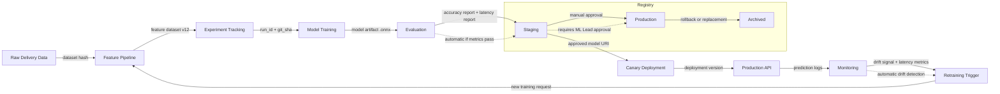

# ETA Model Lifecycle

```mermaid
flowchart LR

A[Raw Delivery Data]
--> |dataset hash| B[Feature Pipeline]

B
--> |feature dataset v12| C[Experiment Tracking]

C
--> |run_id + git_sha| D[Model Training]

D
--> |model artifact .onnx| E[Evaluation]

E
--> |accuracy report + latency report| F[Staging Registry]

F
--> |approved model URI| G[Canary Deployment]

G
--> |deployment version| H[Production API]

H
--> |prediction logs| I[Monitoring]

I
--> |drift signal + latency metrics| J[Retraining Trigger]

J
--> |new training request| B

subgraph Registry
F[Staging]
K[Production]
L[Archived]
end

F
--> |manual approval| K

K
--> |rollback or replacement| L

E -. automatic if metrics pass .-> F

F -. requires ML Lead approval .-> K

I -. automatic drift detection .-> J
```
